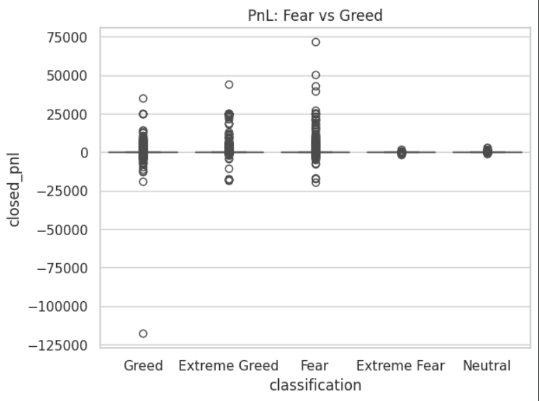
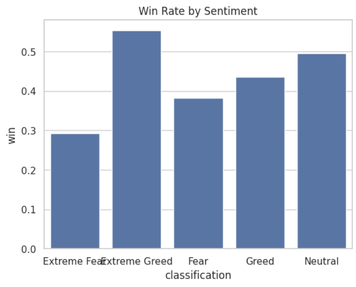

Hyperliquid Trader Behavior vs Market Sentiment

This project looks at how market sentiment (Fear vs Greed) affects trader behavior and performance. The goal was to check whether traders actually perform better in certain conditions or just behave differently.

I used two datasets:
- Sentiment data (Fear/Greed by date)
- Hyperliquid trade-level data

Both were cleaned and aligned on a daily level. From there, I worked with basic metrics like PnL, win rate, trade count, and trade size.

--------------------------------------------------

Visuals:

PnL vs sentiment:

Win rate vs sentiment:

--------------------------------------------------

What I observed:

From the PnL chart, Fear periods clearly show a wider spread. There are both large profits and large losses, which means outcomes are more unpredictable and risk is higher.

In Greed phases, most trades are closer to zero. The results are more stable, but also smaller.

Looking at win rate, there isn’t a meaningful improvement during Greed. Even when the market is positive, traders are not consistently doing better.

Overall:
Fear = higher risk and larger outcomes  
Greed = more stable but not more profitable  

--------------------------------------------------

Behavior changes:

During Fear:
- Outcomes are more extreme
- Suggests more aggressive or reactive trading

During Greed:
- Trades are more controlled
- But most results are small

So behavior does change, but it doesn’t translate into better performance.

--------------------------------------------------

Trader patterns:

Frequent traders:
- Place more trades
- Do not show better performance
- Likely overtrading

Winners vs others:
- A small group makes most of the profit
- Majority stay near break-even

Risk behavior:
- Larger PnL swings during Fear suggest higher risk exposure

--------------------------------------------------

Key takeaways:

- Fear increases both opportunity and risk
- Most traders stay near zero PnL (no strong edge)
- Greed does not improve win rate

--------------------------------------------------

Strategy ideas:

During Fear:
Reduce position size and avoid aggressive trades. Volatility is high and downside risk is large.

During Greed:
Avoid overtrading. Since most trades give small returns, focus on better setups instead of more trades.

--------------------------------------------------

How to run:

Open analysis.ipynb in Google Colab or Jupyter and run all cells from top to bottom.

--------------------------------------------------

Files:

analysis.ipynb : main notebook with full workflow  
pnl_chart.png : PnL distribution chart  
winrate_chart.png : win rate comparison chart  

--------------------------------------------------

Final thought:

Most traders don’t lose big — they just don’t have a consistent edge, so results stay flat over time.
